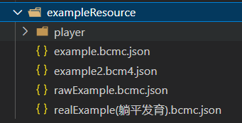

> _@Document version`Kitten4.11.9`_

## 引

本项目研究 [kitten4](https://kitten4.codemao.cn) 剪辑器的文件  
 _**.bcm4**_（工作区文件） 和 _**.bcmc**_（作品预编译文件）

如果您不了解该文件  
可以从以下路径找到示例文件  

## 文档使用符号

-   `*`  
    标记内容均为不可缺的内容  
     如果缺少，player 将拒绝输入该文件

-   `?`  
    不确定内容

-   `D`  
    弃用内容

-   `bc`  
    仅在 .bcmc 出现

-   `b4`
    仅在 .bcm4 出现

其余内容为 bcm4 和 bcmc 共有内容

## 属性路径

-   `/`  
    表示根，就是整个文件 JSON
-   `/xx`  
    表示文件中第一层“xx”属性
-   `/xx/xx` | `/...`  
    属性下属性
